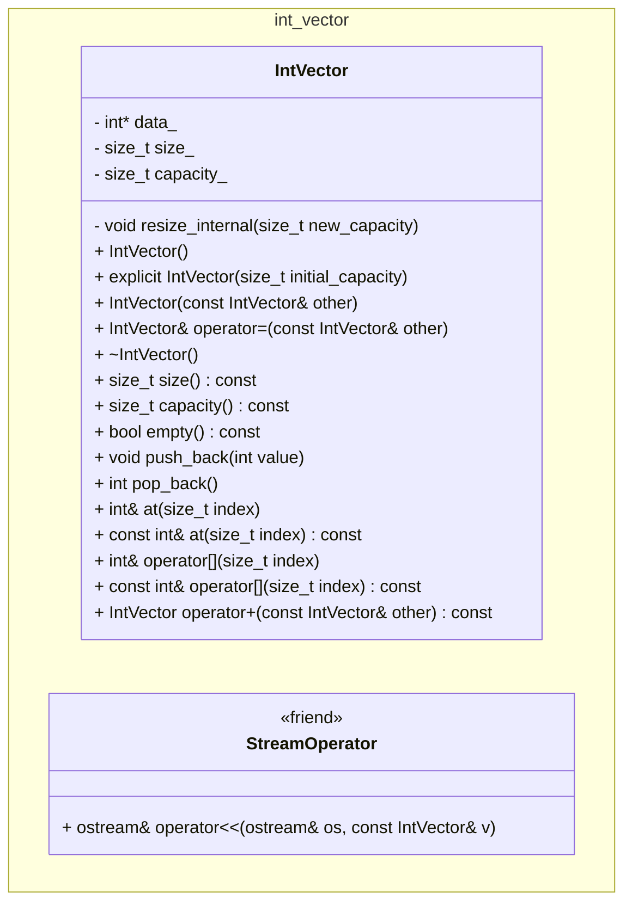

# IntVector

A simple C++ implementation of a dynamic integer array inside the int_vector namespace.

## Class Diagram

```mermaid
classDiagram
    namespace int_vector {
        class IntVector {
            - int* data_
            - size_t size_
            - size_t capacity_
            - void resize_internal(size_t new_capacity)
            
            + IntVector()
            + explicit IntVector(size_t initial_capacity)
            + IntVector(const IntVector& other)
            + IntVector& operator=(const IntVector& other)
            + ~IntVector()
            
            + size_t size() const
            + size_t capacity() const
            + bool empty() const
            
            + void push_back(int value)
            + int pop_back()
            + int& at(size_t index)
            + const int& at(size_t index) const
            + int& operator[](size_t index)
            + const int& operator[](size_t index) const
            
            + IntVector operator+(const IntVector& other) const
        }

        class StreamOperator {
            <<friend>>
            + ostream& operator<<(ostream& os, const IntVector& v)
        }
    }
```